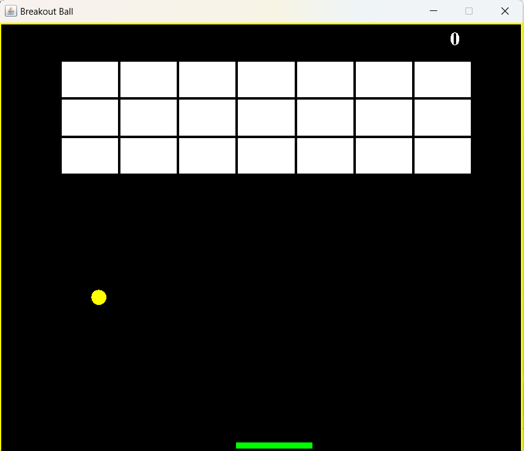
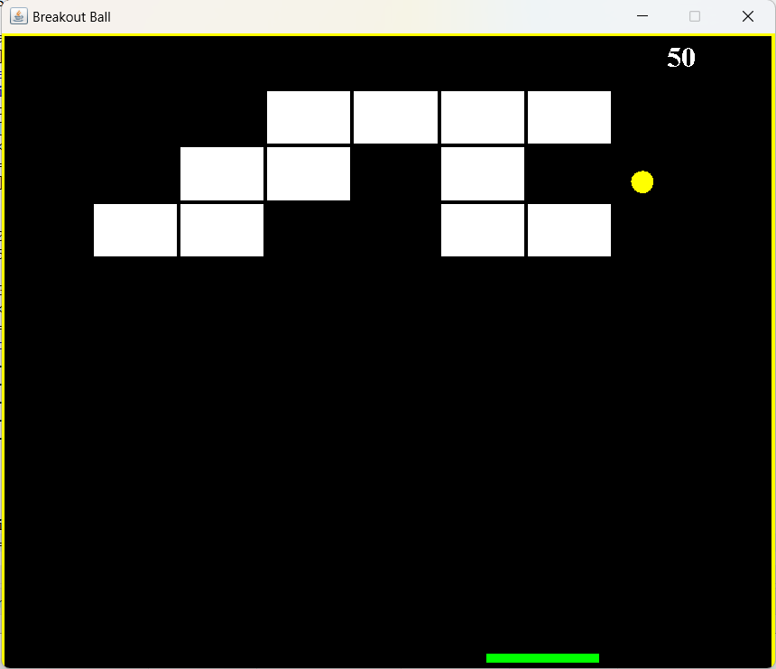

Introduction :
This is a Java implementation of the classic arcade game Brick Breaker. The game involves breaking bricks using a paddle and a ball, with the goal of clearing all the bricks to win the game.

Controls :
Use the left and right arrow keys to move the paddle.
Press enter to restart the game.

Screenshots :

Contact :
For any inquiries or feedback, please contact shimanshi871@gmail.com
